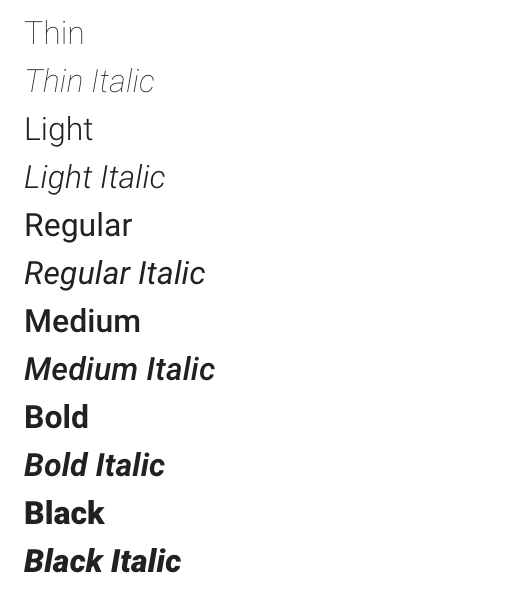

## Typography

---

(description)

https://www.carbondesignsystem.com/guidelines/typography/overview

##### Typeface

Roboto.



```html
<span style="font-size: 0.75rem;">LOVE!</span>
```

Font stack:

```
font-family: 'Roboto', 'Helvetica Neue', Arial, sans-serif;
```

<br/>

##### Sizes/scale
(some screenshot and text)

##### Weight
(some screenshot and text)

##### Color of text
(some screenshot and text)

---

#### Examples

(some examples)

###### Basic Usage

